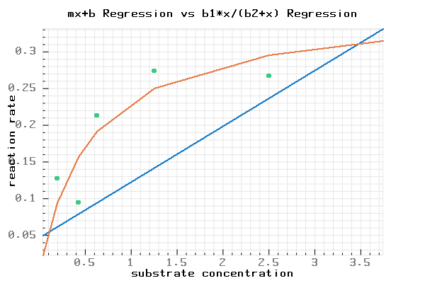

# NumPlot
A regression example from NumCpp using the pbPlots library 

# Include Directory
## You should include the following directories
* pbPlots
* Boost
* Numcpp

# Additional cpp files
## You should move the following cpp files to your project diretory
* pbPlots

# C++ version
## C++14

# Links
## Numcpp
* https://dpilger26.github.io/NumCpp/doxygen/html/index.html
## Boost
* https://www.boost.org/
## pbPlots
* https://github.com/InductiveComputerScience/pbPlots
